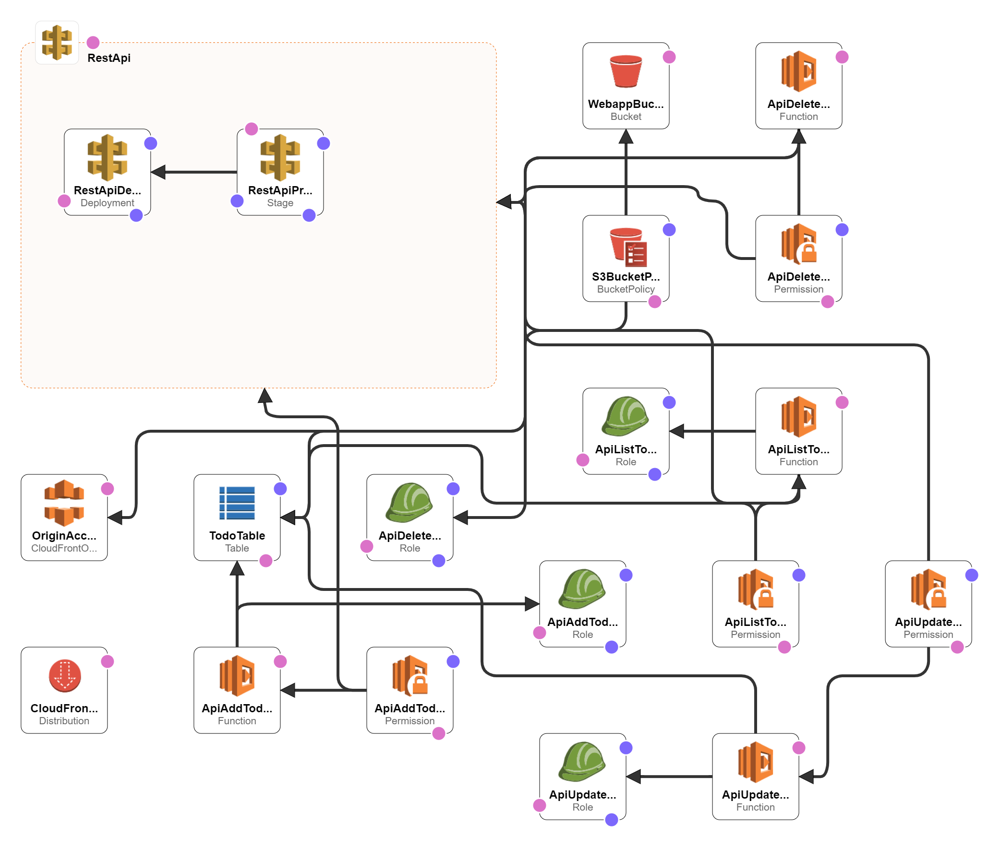

# Purpose
It is using the serverless application model to deploy the application using AWS CloudFormation.

The API backend is implemented using API Gateway and AWS Lambda.

The frontend is written using ReactJS

## AWS Services used

* AWS Lambda - to provide the functionality
* API Gateway - as HTTPS endpoint for the backend
* CloudFront - as entry point to serve API and Frontend
* S3 - to store the static files for the web frontend
* DynamoDB -  database for the stored tasks
* IAM - for least privilege roles to grant access to the database

* CloudFormation - to deploy the application

# Development

The `backend` folder contains the Lambda code for the API and the `frontend` folder contains the ReactJS single page application.

You need NodeJS and NPM to develop in this project.

In `backend` folder dist contains the build code for backend
In `frontend` folder build contains the build code for reactJS

Application uses the SAM Model for deployment

# Deployment

To deploy run the script `deploy.sh` from the command line and have the AWS CLI set up correctly.
`sh deploy.sh`
You can change the aws-profile as per your account.

Deployment steps in shell script :

* First you need to create a bucket by this name ${ACCOUNT_ID}-sam-deploy-${AWS_REGION}
* Next Step is to install dependencies in backend
* Then copy the swagger.yaml file to s3 :  `aws s3 cp backend/swagger.yaml s3://${SAM_BUCKET}/${STACK_NAME}/swagger.yaml`
* Packaging Cloudformation template : `aws cloudformation package --template-file cfn.yaml --s3-bucket ${SAM_BUCKET} --s3-prefix ${STACK_NAME} --output-template-file cfn.packaged.yaml`
* Deployment of Cloudformation template : `aws cloudformation deploy --profile puneet --template-file cfn.packaged.yaml --stack-name aws-challenge --capabilities CAPABILITY_IAM --no-fail-on-empty-changeset`
* Install dependencies and run build for reactJS
* Sync FE with s3 bucket
* Get the cloudfront URL.

